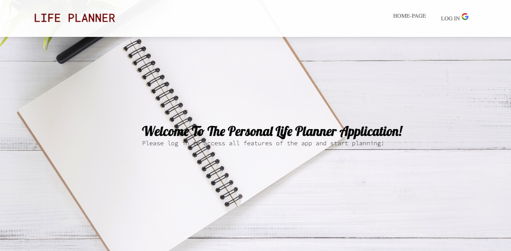
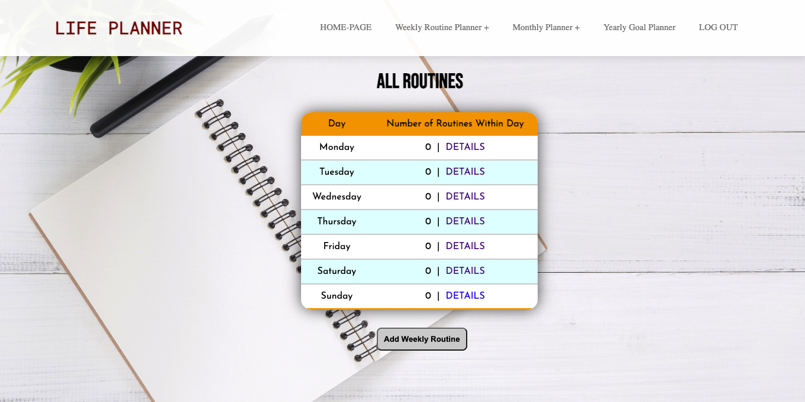
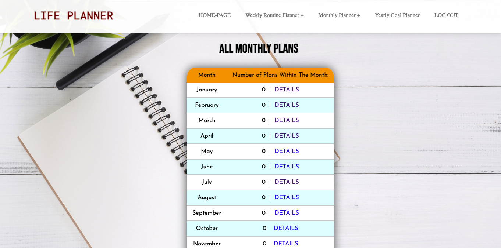
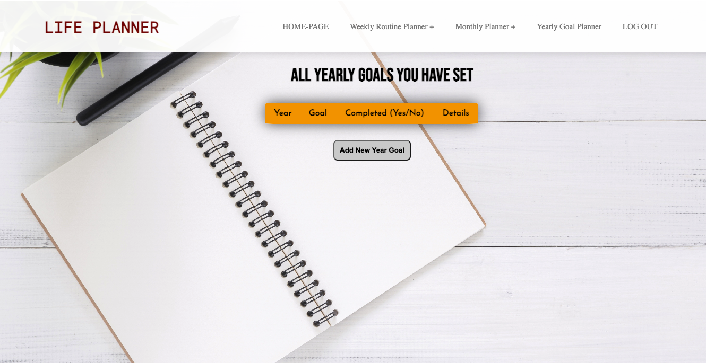
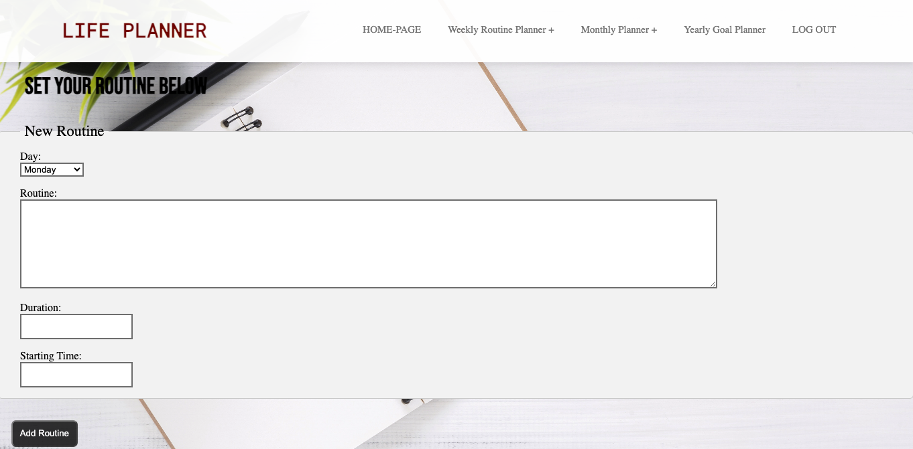
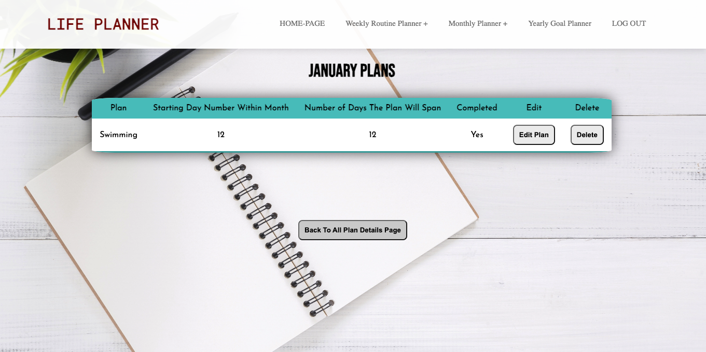
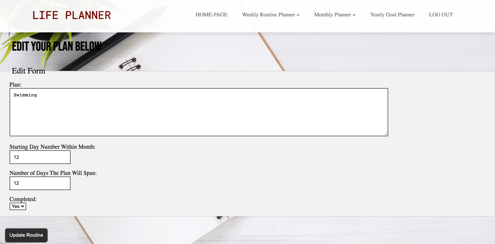

# Life Planner Application
The application essentially acts as a life planner, where the user can set weekly routines, monthly plans, or yearly goals, in three different features/pages of the app respectively. A visitor cannot access any features of the app, and only can view the home page of the app. Aside from that, users can edit and delete the routines, plans, or goals they add. They can also view the routines for each day and plans for each month simply through the navigation bar. 

# SCREENSHOT OF THE GAME

# TECHNOLOGIES USED
- MongoDB
- ExpressJS
- Node.js
- CSS
- HTML

# GETTING STARTED
- App Link: https://William0987.github.io/Node-Express-MongoDB-Full-Stack-CRUD-Life-Planner-Application/

- Trello Board: https://trello.com/b/KUz3Z1Ya/project-2 

# NEXT STEPS
- Add more information in the forms (make entries more detailed).
- Incorporate a journal feature, where users can not only incorporate CRUD features on each daily entry, but can also upload supporting pictures.
- Sort routines and plans based on starting time or starting day respectively regardless of the time they were posted.
- Incorporate more appealing styling.
- If two year goals are added, and they are of the same year, then they will be added to the same details page. 
- Users can make their routines, plans, and goals public or private, so that visitors who haven't logged in yet can get a small understanding of how the app looks/works.

